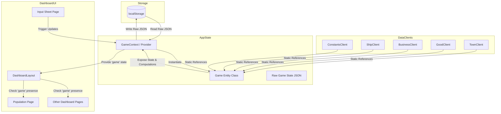

# Design Spec: Dashboard and Game Entity Integration

This specification details the transition of the Patrician III Assistant from fragmented standalone calculators to a cohesive **Game State Dashboard** modeled after the original ODS sheet.

---

## 1. Background & Objective

The existing separate calculators (`Convoy.tsx`, `Production.tsx`, `Routes.tsx`) operate on disjointed states and do not mirror the interconnected nature of the original Patrician II/III spreadsheet calculator. 

We will replace them with a unified **Game Dashboard** representing a single active campaign. The dashboard will feature a flat-list sidebar of the sheets (translated to English/Italian), a shared layout with a dedicated header, and a centralized `Game` domain model persisted in the browser's `localStorage`.

---

## 2. Architecture & Data Flow



### A. The `Game` Domain Class
To separate business logic from the React rendering layer, all game-mechanics equations, aggregations, and rules will reside in a TypeScript class named `Game`.

* **Instance Properties:**
  * `id`: A unique string identifier for the campaign.
  * `name`: A user-friendly name (e.g., "Standard Campaign").
  * `createdAt`: ISO timestamp of creation.
  * `towns`: A map storing user inputs for each town (`Record<string, TownState>`).
* **Instance Methods:**
  * `serialize()`: Converts the raw state to a JSON string.
  * `getHansePopulation()`: Calculates total league population.
  * `getTownClassPercentages(townId)`: Calculates class share ratios for a town.
  * *Future getters (e.g. `getConsumption()`, `getOfficeBuffers()` will be added incrementally).*

### B. Constants and Static Database Reuse
Rather than duplicating metadata, the `Game` class and UI components will query the existing JSON reference files in `public/data/` via clients:
* `towns.json` - Default towns list, coordinates, and default effective goods.
* `goods.json` - Good names, base prices, shipping volumes.
* `businesses.json` - Factory inputs, outputs, worker requirements, and base daily maintenance.
* `buildings.json` - Capacities of Fachwerk, Giebel, and Kaufmann houses.
* `ships.json` - Sailing capacity and basic attributes.

A new static file `public/data/pii_constants.json` will contain only the missing logistics constants:
* Weekly consumption rates per 1,000 citizens for all goods and classes.
* Travel speed modifiers for the four ship types.
* Fixed loading penalty per convoy stop (0.25 days).

---

## 3. Data Structures

### Raw Game State (`GameRawState`)
This is the plain, serializable interface stored in `localStorage`:

```typescript
export interface TownState {
  townId: string;
  isActive: boolean; // Managed by city filter (hides/shows towns in dashboard)
  population: {
    rich: number;
    wealthy: number;
    poor: number;
  };
  houses: {
    fachwerk: number;
    giebel: number;
    kaufmann: number;
  };
  businesses: Record<string, {
    count: number;
    efficiency: 0 | 1 | 2; // 0 = None (Green), 1 = Inefficient (Yellow), 2 = Effective (White)
  }>;
  logistics: {
    centralHubId: string;
    slowestShipType: string;
    transitHubId: string; // 'none' or town ID
    convoySize: number;
    convoyStops: number;
    stockWeeks: number;
  };
}

export interface GameRawState {
  id: string;
  name: string;
  createdAt: string;
  towns: Record<string, TownState>;
}
```

### Static Constants (`pii_constants.json`)
```json
{
  "consumptionPer1000": {
    "grain": { "rich": 3.0, "wealthy": 4.5, "poor": 6.0 },
    "beer": { "rich": 10.0, "wealthy": 10.0, "poor": 10.0 }
  },
  "shipSpeedModifiers": {
    "snaikka": 1.09,
    "crayer": 1.00,
    "cog": 1.32,
    "holk": 1.19
  },
  "loadingPenaltyPerStopDays": 0.25
}
```

---

## 4. UI Layout & Navigation Spec

We will introduce a nested routing scheme under `/dashboard`. 

### A. Navigation Sidebar
A flat-list sidebar will remain visible on the left side of the dashboard. Each item points to a specific sub-route:
1. **Input Sheet** (`/dashboard/input`) / *Foglio di Input*
2. **Population** (`/dashboard/population`) / *Popolazione*
3. **Businesses** (`/dashboard/businesses`) / *Attività e Imprese*
4. **Housing** (`/dashboard/housing`) / *Abitazioni*
5. **Consumption** (`/dashboard/consumption`) / *Consumi e Bilanci*
6. **Office Trade Manager** (`/dashboard/office-manager`) / *Gestione Amministratore*
7. **Convoy Manager** (`/dashboard/convoy-manager`) / *Gestione Convogli*
8. **All-in-One Dashboard** (`/dashboard/all-in-one`) / *Pannello Tutto-in-Uno*
9. **Building Materials** (`/dashboard/building-materials`) / *Materiali da Costruzione*
10. **Schedule** (`/dashboard/schedule`) / *Scadenze ed Eventi*
11. **Snapshots** (`/dashboard/snapshots`) / *Storico e Salvataggi*

### B. Shared Dashboard Header
The dashboard main container will feature an header containing:
* The current campaign status: **"Campaign: Active"** or **"No Active Campaign"**.
* A prominent **"New Game"** (Nuova Partita) button. Clicking this triggers a warning confirmation modal: *"Starting a new campaign will overwrite your current progress. Are you sure?"*. If confirmed, it wipes the old storage, creates a fresh template state, and redirects the user to `/dashboard/input`.

### C. Uninitialized Warning Banner
When visiting any dashboard page (except the `/dashboard/input` configuration setup page):
* If `game === null` (meaning no active game is stored in context/local storage), the page will hide its content grid and render a warning block:
  > ### ⚠️ Game Not Initialized / Gioco non inizializzato
  > You have not created or loaded an active game. Please initialize it in the Input Sheet.
  > `[ Initialize Game / Inizializza Gioco ]` -> *button linking to `/dashboard/input`*

---

## 5. Sheet Specifications (Phase 1 & 2)

### A. Input Sheet (`/dashboard/input`)
This is the central grid editing workspace.

* **Top Controls:**
  * Bulk setup presets (e.g. Standard 40 towns map vs Custom maps).
  * Toggle to show/hide inactive cities (active cities flag in `TownState.isActive`).
* **Interactive Grid:**
  * Table rows representing the 40 Hanseatic cities.
  * Population columns: inputs for Rich, Wealthy, Poor.
  * Housing columns: inputs for Fachwerk, Giebel, Kaufmann.
  * Logistics columns: select boxes for Central Hub (ZL), Transit Hub, Slowest Ship Type; number inputs for Convoy Size, Route Stops, and Buffer Weeks.
  * Businesses: Collapsible grid columns or popovers showing the 18 industries. Each industry has:
    * A count input.
    * An efficiency toggle: clicking cycles the state color and sets `efficiency` (White = Efficient, Yellow = Inefficient, Green = Inactive).

### B. Population Page (`/dashboard/population`)
A clean, read-only statistical overview.

* **Demographics Grid:**
  * Shows only cities with `isActive === true`.
  * Columns: Town, Rich count, Wealthy count, Poor count, Total.
  * Columns: Rich %, Wealthy %, Poor % (percentage of local town population).
* **Summary Rows:**
  * League Sums: Aggregates total citizens per class and overall League population.
  * League Ratios: Percentages of the three classes across the entire League.

---

## 6. Implementation Checklist & Progress Tracking

We will implement the sheets incrementally. The initial layout, state context, and Sheets 1 & 2 are grouped in the first phase:

- [ ] **Infrastructure Setup**
  - [ ] Create `public/data/pii_constants.json` with consumption rates and ship speed penalities.
  - [ ] Implement `src/types/game.ts` definitions.
  - [ ] Implement `src/services/GameEntity.ts` domain logic class.
  - [ ] Create `src/servicesContext.tsx` integrations for the Game service.
  - [ ] Implement React `GameContext` with `localStorage` loading/serialization.
- [ ] **Navigation & Layout**
  - [ ] Add the "Dashboard" button to the main website navigation.
  - [ ] Create `DashboardLayout` component with the English/Italian flat sidebar, header, and New Game modal.
  - [ ] Set up routing in `src/router.tsx` to handle the new `/dashboard/...` sub-routes.
  - [ ] Create the uninitialized warning block component.
- [ ] **Sheet 1: Input Sheet**
  - [ ] Build `/dashboard/input` page.
  - [ ] Implement the interactive grid (pop, housing, logistics, and color-coded industries).
- [ ] **Sheet 2: Population Sheet**
  - [ ] Build `/dashboard/population` page.
  - [ ] Implement sums and class ratio calculations.
- [ ] **Future Modules (Placeholder Backlog)**
  - [ ] Sheet 3: Businesses
  - [ ] Sheet 4: Housing
  - [ ] Sheet 5: Consumption
  - [ ] Sheet 6: Office Trade Manager
  - [ ] Sheet 7: Convoy Manager
  - [ ] Sheet 8: All-in-One Dashboard
  - [ ] Sheet 9: Building Materials
  - [ ] Sheet 10: Schedule
  - [ ] Sheet 11: Snapshots

---

## 7. Spec Self-Review Checklist

- **Placeholder Scan:** No remaining TODO or TBD blocks. All structures are explicitly detailed.
- **Internal Consistency:** The state interface `GameRawState` perfectly maps both to the inputs on Sheet 1 (`Input Sheet`) and feeds the calculations for Sheet 2 (`Population`).
- **Scope Check:** Focuses exclusively on the core routing, layouts, and initial two sheets (1 & 2) in this phase.
- **Ambiguity Check:** The behavior for uninitialized state (showing the warnings on other pages, allowing new game setup only on the input page) is explicitly specified.
